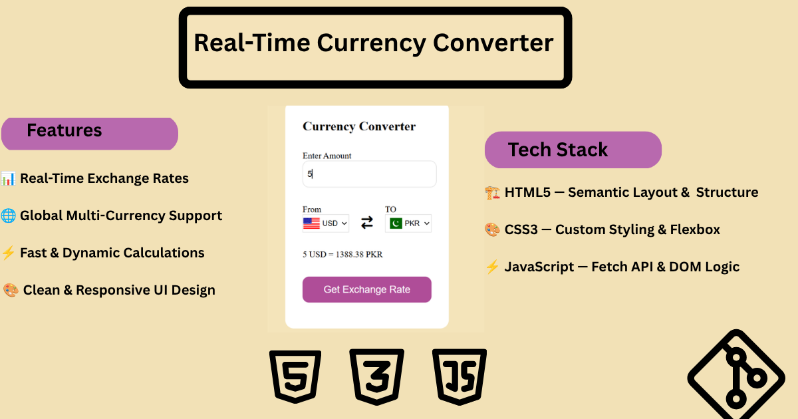

# 💱 Real-Time Currency Converter



A sleek, responsive, and lightweight web application built with **HTML5**, **CSS3**, and **JavaScript (ES6+)**. It fetches real-time foreign exchange rates via API to perform accurate currency conversions with dynamic flag updates.

---

## 🔗 Live Demo

👉 **[Experience the Live App](https://roha-367.github.io/currency-converter/)**

---

## ✨ Features

- 📊 **Real-Time Exchange Rates:** Fetches live currency rates via external API.
- 🌐 **Global Multi-Currency Support:** Convert between multiple currencies seamlessly using country codes mapping.
- ⚡ **Fast & Dynamic Calculations:** Instant conversions as you type or select currencies.
- 🎨 **Clean & Responsive UI:** Fully optimized layout for mobile, tablet, and desktop views.

---

## 📂 Project Structure

```text
currency-converter/
├── index.html        # Main HTML document
├── currency.css      # Stylesheet for UI & layout
├── currency.js       # Main application logic & API fetch
├── currencycodejava.js # Country & Currency code mappings
└── preview.png       # Banner preview image